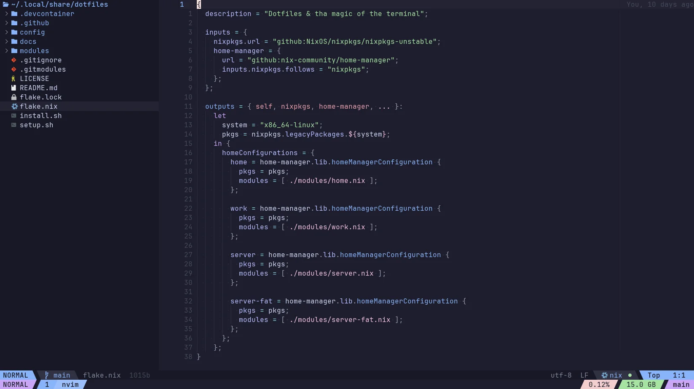
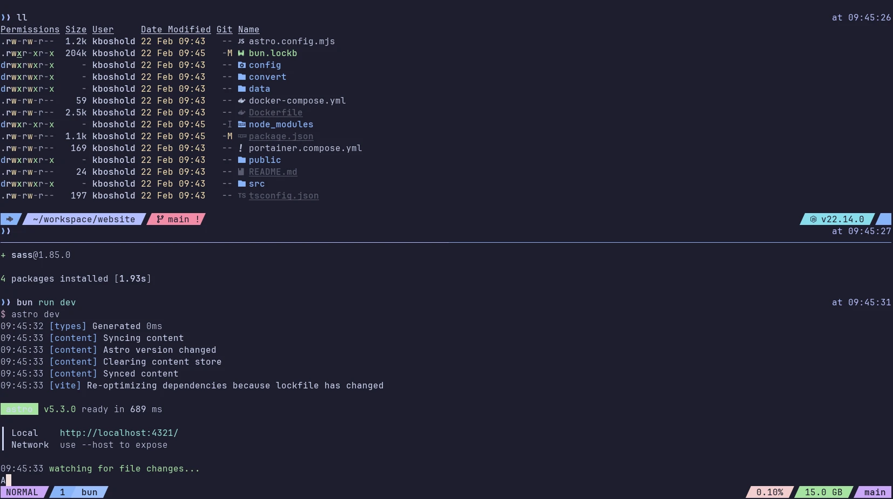
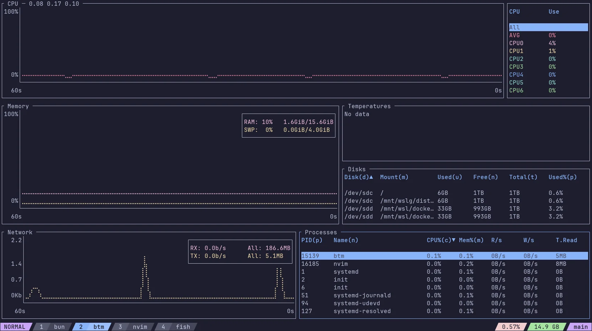
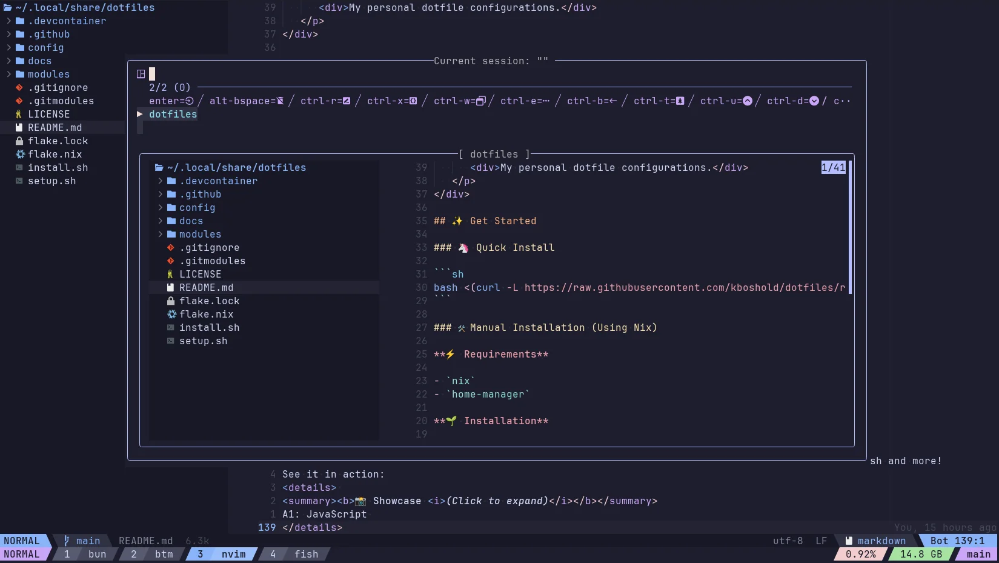

<div align="center">
   <p>
      <a href="https://github.com/kboshold/dotfiles#is=awesome">
         <picture>
            <source media="(prefers-color-scheme: dark)" type="image/svg+xml" srcset="./docs/assets/logo_dark.svg">
            
         </picture>
      </a>
   </p>
   <p>
      <a href="https://github.com/kpalatzky/dotfiles/blob/master/flake.nix">
         <picture>
            <source media="(prefers-color-scheme: dark)" type="image/svg+xml" srcset="https://img.shields.io/badge/nix-flake-b4befe?logo=nixos&labelColor=313244">
            
         </picture>
      </a>
      <a href="https://github.com/kpalatzky/nvim.dotfiles">
         <picture>
            <source media="(prefers-color-scheme: dark)" type="image/svg+xml" srcset="https://img.shields.io/badge/%3E%3D0.11.0-74c7ec?logo=neovim&label=neovim&labelColor=313244&logoColor=74c7ec">
            = 0.11.0" src="https://img.shields.io/badge/%3E%3D0.11.0-1e66f5?logo=neovim&label=neovim&labelColor=ccd0da&logoColor=1e66f5">
         </picture>
      </a>
      <a href="https://github.com/kpalatzky/dotfiles/blob/master/config/tmux">
         <picture>
            <source media="(prefers-color-scheme: dark)" type="image/svg+xml" srcset="https://img.shields.io/badge/%3E%3D3.5a-a6e3a1?logo=tmux&label=tmux&labelColor=313244&logoColor=a6e3a1">
            = 3.5a" src="https://img.shields.io/badge/%3E%3D3.5a-40a02b?logo=tmux&label=tmux&labelColor=ccd0da&logoColor=40a02b">
         </picture>
      </a>
      <a href="https://github.com/kpalatzky/dotfiles/blob/master/config/fish">
         <picture>
            <source media="(prefers-color-scheme: dark)" type="image/svg+xml" srcset="https://img.shields.io/badge/%3E%3D4.0.2-74c7ec?label=%F0%9F%90%9F%20fish&labelColor=313244">
            = 4.0.2" src="https://img.shields.io/badge/%3E%3D4.0.2-1e66f5?label=%F0%9F%90%9F%20fish&labelColor=ccd0da">
         </picture>
      </a>
      <a href="https://github.com/kpalatzky/dotfiles/blob/master/LICENSE">
         <picture>
            <source media="(prefers-color-scheme: dark)" type="image/svg+xml" srcset="https://img.shields.io/github/license/kpalatzky/dotfiles.svg?color=cba6f7&labelColor=313244">
            
         </picture>
      </a>
      <br>
      <a href="https://github.com/sharkdp/bat">
         <picture>
            <source media="(prefers-color-scheme: dark)" type="image/svg+xml" srcset="https://img.shields.io/badge/bat-585b70?label=%E2%9C%A8&labelColor=313244&logoColor=585b70">
            
         </picture>
      </a>
      <a href="https://github.com/junegunn/fzf">
         <picture>
            <source media="(prefers-color-scheme: dark)" type="image/svg+xml" srcset="https://img.shields.io/badge/fzf-585b70?label=%E2%9C%A8&labelColor=313244&logoColor=585b70">
            
         </picture>
      </a>
      <a href="https://github.com/BurntSushi/ripgrep">
         <picture>
            <source media="(prefers-color-scheme: dark)" type="image/svg+xml" srcset="https://img.shields.io/badge/ripgrep-585b70?label=%E2%9C%A8&labelColor=313244&logoColor=585b70">
            
         </picture>
      </a>
      <a href="https://github.com/eza-community/eza">
         <picture>
            <source media="(prefers-color-scheme: dark)" type="image/svg+xml" srcset="https://img.shields.io/badge/eza-585b70?label=%E2%9C%A8&labelColor=313244&logoColor=585b70">
            
         </picture>
      </a>
      <a href="https://github.com/jdx/mise">
         <picture>
            <source media="(prefers-color-scheme: dark)" type="image/svg+xml" srcset="https://img.shields.io/badge/mise-585b70?label=%E2%9C%A8&labelColor=313244&logoColor=585b70">
            
         </picture>
      </a>
      <a href="https://github.com/atuinsh/atuin">
         <picture>
            <source media="(prefers-color-scheme: dark)" type="image/svg+xml" srcset="https://img.shields.io/badge/atuin-585b70?label=%E2%9C%A8&labelColor=313244&logoColor=585b70">
            
         </picture>
      </a>
      <a href="https://github.com/starship/starship">
         <picture>
            <source media="(prefers-color-scheme: dark)" type="image/svg+xml" srcset="https://img.shields.io/badge/starship-585b70?label=%E2%9C%A8&labelColor=313244&logoColor=585b70">
            
         </picture>
      </a>
      <a href="https://github.com/ClementTsang/bottom">
         <picture>
            <source media="(prefers-color-scheme: dark)" type="image/svg+xml" srcset="https://img.shields.io/badge/bottom-585b70?label=%E2%9C%A8&labelColor=313244&logoColor=585b70">
            
         </picture>
      </a>
      <a href="https://github.com/ajeetdsouza/zoxide">
         <picture>
            <source media="(prefers-color-scheme: dark)" type="image/svg+xml" srcset="https://img.shields.io/badge/zoxide-585b70?label=%E2%9C%A8&labelColor=313244&logoColor=585b70">
            
         </picture>
      </a>
   </p>
   <hr>
   <p>
      <h3>✨ Want to be a terminal wizard? ✨</h3>
      <div>My personal dotfile configurations.</div>
   </p>
</div>

## ✨ Get Started

### 🦄 Quick Install

```sh
bash <(curl -L https://raw.githubusercontent.com/kboshold/dotfiles/refs/heads/main/install.sh)
```

### 🛠️ Manual Installation (Using Nix)

**⚡️ Requirements**

- `nix`
- `home-manager`

**🌱 Installation**

Clone the respository to have the dotfile locally:

```sh
git clone https://github.com/kboshold/website ~/.local/share/dotfiles
git -C "~/.local/share/dotfiles" submodule update --init --recursive
```

Now enable the flake using the following command
```sh
home-manager switch --flake "~/.local/share/dotfiles?submodules=1#home" --impure -b bckp
```

## 🕺 Overview
The configuration includes some cool features: a stunning Nvim configuration, as well as Tmux, Fish and more!
See it in action:
<details open> 
<summary><b>📸 Showcase <i>(Click to expand)</i></b></summary>
<b>Neovim</b>

<b>Tmux running bun</b>

<b>Tmux running bottom</b>

<b>Tmux session manager</b>

</details>

